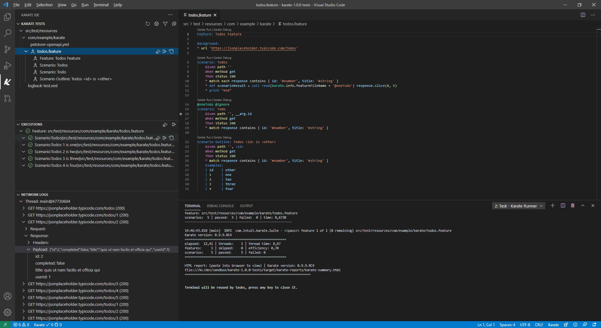
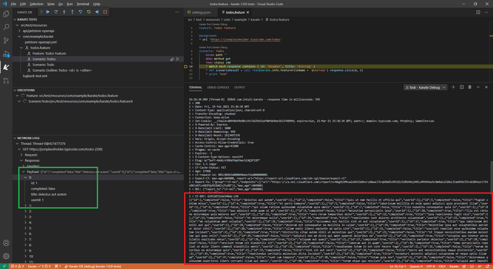
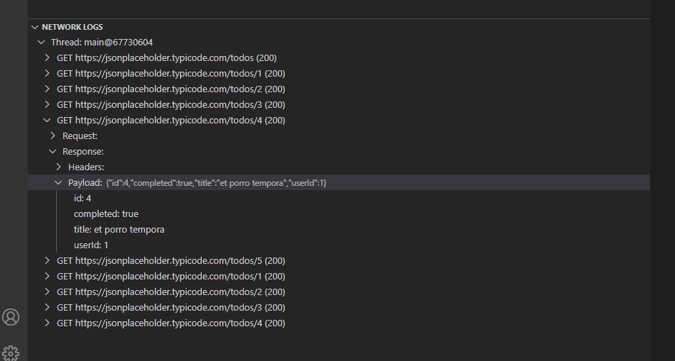
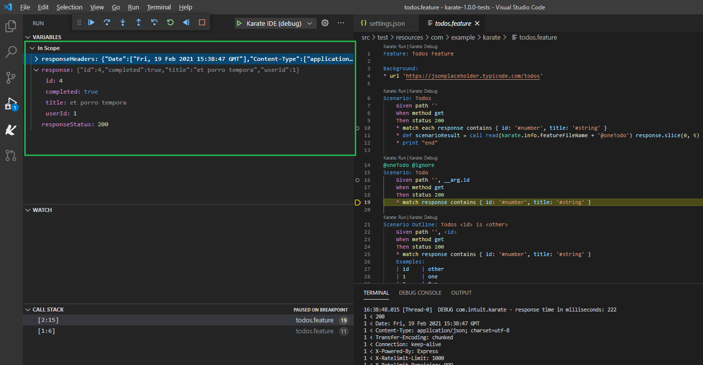

# Karate IDE

Explore your APIs and Debug [Karate](https://github.com/intuit/karate) test scripts within VS Code.

This is not the official vscode extension. Here you can find the original [Karate Runner](https://github.com/kirksl/karate-runner/)

This project started from original [Karate Runner](https://github.com/kirksl/karate-runner/). Lot of functionality has been added, configuration was refactored and big portions of code rewritten from scratch.

This VS Code extension is only compatible with Karate 1.0.0+ while [Karate Runner](https://github.com/kirksl/karate-runner/) remains compatible with all versions of Karate.

> :warning: **Beta**: This is an unfinished and beta extension.

- [Karate IDE](#karate-ide)
  - [Debug Karate Scripts](#debug-karate-scripts)
  - [Explore your APIs](#explore-your-apis)
    - [Structured HTTP Log Viewer](#structured-http-log-viewer)
    - [Structured (tree-like) json variables in debuger](#structured-tree-like-json-variables-in-debuger)
    - [Generating Code from OpenAPI definitions](#generating-code-from-openapi-definitions)
    - [Reusing generated Scenarios in complex flow/squence tests](#reusing-generated-scenarios-in-complex-flowsquence-tests)
    - [Generating Code from cURL (Smart Paste)](#generating-code-from-curl-smart-paste)
    - [Generating Mocks from cURL commands output (Smart Paste)](#generating-mocks-from-curl-commands-output-smart-paste)
  - [Other functionality](#other-functionality)
    - [Peek](#peek)
  - [Configuration](#configuration)
    - [.vscode/launch.json](#vscodelaunchjson)
    - [Karate classpath](#karate-classpath)
      - [Using karate.jar (Karate fat jar)](#using-karatejar-karate-fat-jar)
      - [Using mvn dependency:copy-dependencies](#using-mvn-dependencycopy-dependencies)
      - [Using mvn dependency:build-classpath](#using-mvn-dependencybuild-classpath)
    - [Run/Debug command templates](#rundebug-command-templates)

## Debug Karate Scripts

You can Debug [Karate](https://github.com/intuit/karate) scripts, using:

-   set breakpoints
-   step-by-step debuging
-   navigate scenario call stack with their variables
-   inspect and copy variables, values or their json path expression
-   interactive debug console where you can print, update variable values or test jsonPath expressions
-   hot reloading (with caveants)

It includes DebugAdapter originaly developed by [Peter Thomas](https://github.com/intuit/karate/) and [Kirk Slota](https://github.com/kirksl/karate-runner/).

https://twitter.com/KarateDSL/status/1167533484560142336

## Explore your APIs

Now you can also explore your API from within VS Code. Karate is (one of) the best API testing automation tools.

With this extension you can leverage your existing scripts to explore your API while you developing your test scripts. No need to maintain a separate collection or switch between different programs.

You can also use this extension to generate reusable tests scripts from OpenAPI and cURL to speed up your development and api exploration.



### Structured HTTP Log Viewer

Forget about reading response payload from text log files.





### Structured (tree-like) json variables in debuger

With Karate 1.0.0+ you can inspect debuger variables as an structured tree, not just like json strings:



### Generating Code from OpenAPI definitions

To quickly test/explore your APIs you can generate reusable karate scenarios from your openapi definitions, with test-data yml files.


### Reusing generated Scenarios in complex flow/squence tests

This generated scenarios can be reused and invoked from inside other tests, implementing more complex sequences or flows.

You don't need to keep writting http based scenarios but directly reference your API operations by the very name they are documented in your OpenAPI definition.


### Generating Code from cURL (Smart Paste)

If a `curl` command is detected while pasting into feature files it will be transformed into Karate syntax and pasted into the VSCode Editor.

### Generating Mocks from cURL commands output (Smart Paste)

If a `curl` command... TODO

## Other functionality

### Peek

You can navigate between files, features and scenario @tags using `Control-Click`

You can also navigate to scenarios by _@tag_ in the same or in different feature file (TODO)

## Configuration

### .vscode/launch.json

When you click `Karate Debug` for the first time if `.vscode/launch.js` does not exist one will be created for you with this contents. This is a one time step, after this file is created you can start debuging normally.

```json
{
    // Use IntelliSense to learn about possible attributes.
    // Hover to view descriptions of existing attributes.
    // For more information, visit: https://go.microsoft.com/fwlink/?linkid=830387
    "version": "0.2.0",
    "configurations": [
        {
            "type": "karate-ide",
            "name": "Karate IDE (debug)",
            "request": "launch"
        }
    ]
}
```

### Karate classpath

Karate-IDE classpath is the one configuration that won't work out of the box and you will need to make a decision about.

You need to provide a way for Karate-IDE to find karate java classes (namely karate.jar)

#### Using karate.jar (Karate fat jar)

Easiest way. Download the latest executable form https://dl.bintray.com/ptrthomas/karate/ and rename it to your project's root folder as `karate.jar`. You don't need to configure anything else but your classpath will be very limited.

Alternatively you can download it to a different path configure in `.vscode/settings.json` where your karate.jar is located.

```json
{
    "karateIDE.karateCli.classpath": "<path to your file>/karate.jar"
}
```

(This is a very limited setup as no other project folders or dependencies will be added to karate runtime classpath, and that includes `karate-config.js`)

#### Using mvn dependency:copy-dependencies

If you are using maven, this is our **recommended** way to get a full project classpath while debuging with vscode. First you need to run the following command in order to download all project dependencies to `target/dependency`:

```
mvn dependency:copy-dependencies
```

Configure this in `.vscode/settings.json` (Replace `;` (for windows) with `:` (for other OS))

```json
{
    "karateIDE.karateCli.classpath": "target/classes;target/test-classes;src/test/resources;src/test/java;target/dependency/*"
}
```

**NOTE:** always remember to re-download dependencies again after mvn clean os any dependency version upgrade.

#### Using mvn dependency:build-classpath

If you are lucky you may be able to configure "karateIDE.karateCli.classpath" with the output from this mvn command

```
mvn dependency:build-classpath
```

### Run/Debug command templates

Karate-IDE uses a _template_ for configuring Run and Debug commands.

Default configuration favors KarateCli but you can build any command line you would like for your Operating System, default shell and/or build system (mvn, gradle,...).

**Default configured templates works out of the box with PowerShell, Bash and Zsh so in most cases you shouldn't need to configure these.**

```json
{
    "karateIDE.karateCli.runCommandTemplate": "java '-Dkarate.env=${karateEnv}' '-Dvscode.port=${vscodePort}' -cp '${classpath}' com.intuit.karate.Main ${karateOptions} '${feature}'",
    "karateIDE.karateCli.debugCommandTemplate": "java '-Dkarate.env=${karateEnv}' '-Dvscode.port=${vscodePort}' -cp '${classpath}' com.intuit.karate.Main -d"
}
```

There is also `${KarateTestRunner}` template variable if you want to build a command line for JUnit tests.

**Enjoy!**
