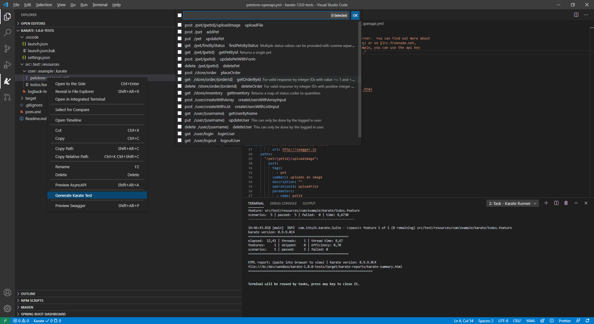
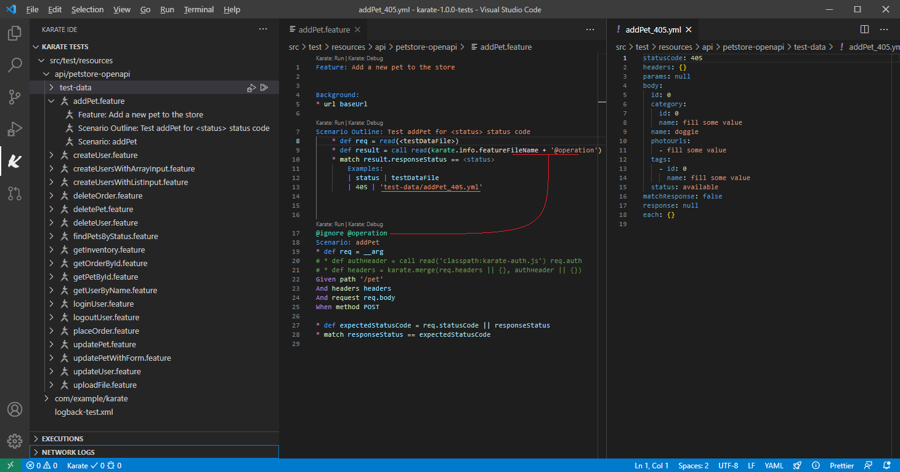
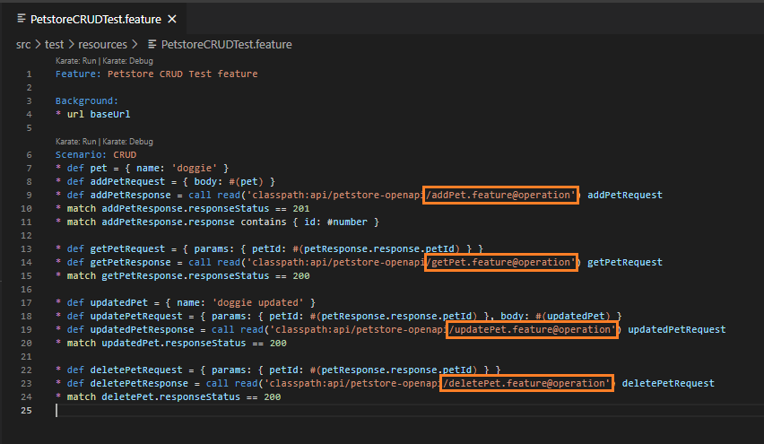

# Karate IDE

Explore your APIs and Debug [Karate](https://github.com/intuit/karate) test scripts within VS Code.

This is not the official vscode extension. Here you can find the original [Karate Runner](https://github.com/kirksl/karate-runner/)

This project started from original [Karate Runner](https://github.com/kirksl/karate-runner/). Lot of functionality has been added, configuration was refactored and big portions of code rewritten from scratch.

It works out of the box with different ways to execute karate: using [jbang](https://www.jbang.dev/), karate.jar standalone, maven or any custom classpath.

It features **code generation** from openapi definitions for both **tests** and **mocks** (server side features), running your tests and starting your mocks from a menu, **tree-like http log viewer** like you would expect in Postman or chrome-dev-tools, copy http request logs as cURL, smart paste of cURL commands as test Scenarios, code navigation between local and classpath files (it honors your [classpath setting](#karate-classpath)) with _control-click_, _karate.env_ switcher, focus on tests by name and @tag, **autocompletion** of classpath features and feature tags...

This VS Code extension is only compatible with Karate 1.0.0+ while [Karate Runner](https://github.com/kirksl/karate-runner/) remains compatible with all versions of Karate.

<!-- TOC -->

- [Karate IDE](#karate-ide)
    - [Debug Karate Scripts](#debug-karate-scripts)
    - [Explore your APIs](#explore-your-apis)
        - [Structured HTTP Log Viewer](#structured-http-log-viewer)
        - [Structured tree-like json variables in debuger](#structured-tree-like-json-variables-in-debuger)
        - [Generating Code from OpenAPI definitions](#generating-code-from-openapi-definitions)
            - [Generating Test Features from OpenAPI definitions](#generating-test-features-from-openapi-definitions)
            - [Reusing generated Scenarios in complex flow/squence tests](#reusing-generated-scenarios-in-complex-flowsquence-tests)
            - [Generating complete Mocks from OpenAPI definitions](#generating-complete-mocks-from-openapi-definitions)
        - [Generating Code from cURL Smart Paste](#generating-code-from-curl-smart-paste)
        - [Generating Mocks from cURL commands output Smart Paste](#generating-mocks-from-curl-commands-output-smart-paste)
    - [Other functionality](#other-functionality)
        - [Karate.env switcher](#karateenv-switcher)
        - [Tests Filtering / Focus](#tests-filtering--focus)
        - [Code Navigation and Definition Peek](#code-navigation-and-definition-peek)
        - [Auto-Completion](#auto-completion)
        - [Start your Mocks server from a menu](#start-your-mocks-server-from-a-menu)
    - [Configuration](#configuration)
        - [vscode/launch.json](#vscodelaunchjson)
        - [Karate classpath](#karate-classpath)
            - [Using karate.jar Karate fat jar](#using-karatejar-karate-fat-jar)
            - [Using maven repository dependencies](#using-maven-repository-dependencies)
                - [Using mvn dependency:build-classpath](#using-mvn-dependencybuild-classpath)
                - [Using mvn dependency:copy-dependencies](#using-mvn-dependencycopy-dependencies)
            - [With jBang](#with-jbang)
        - [Run/Debug command templates](#rundebug-command-templates)

<!-- /TOC -->
## Debug Karate Scripts

You can Debug [Karate](https://github.com/intuit/karate) scripts, using:

-   set breakpoints
-   step-by-step debuging
-   navigate scenario call stack with their variables
-   inspect and copy variables, values or their json path expression
-   interactive debug console where you can print, update variable values or test jsonPath expressions
-   hot reloading (with caveants)

It includes DebugAdapter originaly developed by [Peter Thomas](https://github.com/intuit/karate/) and [Kirk Slota](https://github.com/kirksl/karate-runner/).

https://twitter.com/KarateDSL/status/1167533484560142336

## Explore your APIs

Now you can also explore your API from within VS Code. Karate is (one of) the best API testing automation tools.

With this extension you can leverage your existing scripts to explore your API while you developing your test scripts. No need to maintain a separate collection or switch between different programs.

You can also use this extension to generate reusable tests scripts from OpenAPI and cURL to speed up your development and api exploration.


### Structured HTTP Log Viewer

Forget about reading response payload from text log files.


### Structured (tree-like) json variables in debuger

With Karate 1.0.0+ you can inspect debuger variables as an structured tree, not just like json strings:


### Generating Code from OpenAPI definitions

#### Generating Test Features from OpenAPI definitions

To quickly test/explore your APIs you can generate reusable karate scenarios from your openapi definitions, with test-data yml files.





#### Reusing generated Scenarios in complex flow/squence tests

This generated scenarios can be reused and invoked from inside other tests, implementing more complex sequences or flows.

You don't need to keep writting http based scenarios but directly reference your API operations by the very name they are documented in your OpenAPI definition.



#### Generating complete Mocks from OpenAPI definitions

You can also generate Mock features for your complete api from openapi definitions. Right click in a openapi yml file and select `Generate Karate Mocks`.
### Generating Code from cURL (Smart Paste)

If a `curl` command is detected while pasting into feature files it will be transformed into Karate syntax and pasted into the VSCode Editor.

### Generating Mocks from cURL commands output (Smart Paste)

If a `curl` command... TODO

## Other functionality

### Karate.env switcher

You can switch karate.env from the grear icon on tests tree view. When using Karate-IDE for manual testing or exploring APIs you will find very handy this environment switcher.

### Tests Filtering / Focus

You have two different ways to filter files that appears on Tests Tree View: using `karateIDE.tests.globFilter` in settings for global filtering and `Focus` icon for temporal filtering of tests and tags.

In `Focus` you can filter by name pattern and by scenario _@tags_ supporting "or & and" constructions: separate tags by comma for AND, quote them for OR and prefix the with ~@ for NOT.
### Code Navigation and Definition Peek

You can navigate between files, features and scenario @tags using `Control-Click` or _peek_ definitions with `Alt+F12`

You can also navigate to scenarios by _@tag_ in the same or in different feature file.

It honors your [classpath](#karate-classpath) setting when navigating to files with `classpath:` prefix.

### Auto-Completion

When reading yml/json files are calling other features you can autocomplete their names with teh list of local and classpath files.

It honors your [classpath](#karate-classpath) setting when navigating to files with `classpath:` prefix.

### Start your Mocks server from a menu

Right click on a *.feature file and click `Start Karate Mock Server`

## Configuration

### .vscode/launch.json

When you click `Karate Debug` for the first time if `.vscode/launch.js` does not exist one will be created for you with this contents. This is a one time step, after this file is created you can start debuging normally.

```json
{
    "version": "0.2.0",
    "configurations": [
        {
            "type": "karate-ide",
            "name": "Karate IDE (debug)",
            "request": "launch"
        }
    ]
}
```

### Karate classpath

Karate runtime is java based so you need to tell Karate-IDE where to find karate.jar dependencies.

If you are not sure or you have no special classpath requirements just use karate.jar configuration option.

If you are using maven you can configurea fully fledged maven classpath and Karate-IDE will honor your classpath settings when autocompleting and navigating/peeking code.

#### Using karate.jar (Karate fat jar)

This is the simplest way if all you need is karate.jar in your classpath. 

Download the latest executable form https://dl.bintray.com/ptrthomas/karate/ and rename it to your project's root folder as `karate.jar`. You don't need to configure anything else but your classpath will be very limited.

Alternatively you can download it to a different path configure where your karate.jar is located in `File > Preferences > Settings` globally or in `.vscode/settings.json` for current project.

```json
{
    "karateIDE.karateCli.classpath": "src/test/resources;<path to your file>/karate.jar"
}
```

(This is a very limited setup as no other project folders or dependencies will be added to karate runtime classpath, and that includes `karate-config.js`)

#### Using maven repository dependencies

If you are using maven you can configure `classpath` setting pointing to your maven repo dependencies and build a fully functional classpath.

This is our **recommended** way to get a full project classpath while debuging with vscode.

##### Using mvn dependency:build-classpath

Configure this in `File > Preferences > Settings` globally or in `.vscode/settings.json`.

**IMPORTANT:** Replace `;` (for windows) with `:` (for other OS))


```json
{
    "karateIDE.karateCli.karateEnv": "local",
    // full classpath for karate 1.0.1 version
    "karateIDE.karateCli.classpath": "src/main/resources;src/test/resources;target/classes;target/test-classes;${m2.repo}/com/intuit/karate/karate-core/1.0.1/karate-core-1.0.1.jar;${m2.repo}/org/graalvm/js/js-scriptengine/21.0.0/js-scriptengine-21.0.0.jar;${m2.repo}/org/graalvm/sdk/graal-sdk/21.0.0/graal-sdk-21.0.0.jar;${m2.repo}/org/graalvm/js/js/21.0.0/js-21.0.0.jar;${m2.repo}/org/graalvm/regex/regex/21.0.0/regex-21.0.0.jar;${m2.repo}/org/graalvm/truffle/truffle-api/21.0.0/truffle-api-21.0.0.jar;${m2.repo}/com/ibm/icu/icu4j/67.1/icu4j-67.1.jar;${m2.repo}/ch/qos/logback/logback-classic/1.2.3/logback-classic-1.2.3.jar;${m2.repo}/ch/qos/logback/logback-core/1.2.3/logback-core-1.2.3.jar;${m2.repo}/org/slf4j/slf4j-api/1.7.25/slf4j-api-1.7.25.jar;${m2.repo}/org/slf4j/jcl-over-slf4j/1.7.25/jcl-over-slf4j-1.7.25.jar;${m2.repo}/com/jayway/jsonpath/json-path/2.5.0/json-path-2.5.0.jar;${m2.repo}/net/minidev/json-smart/2.3/json-smart-2.3.jar;${m2.repo}/net/minidev/accessors-smart/1.2/accessors-smart-1.2.jar;${m2.repo}/org/ow2/asm/asm/5.0.4/asm-5.0.4.jar;${m2.repo}/info/cukes/cucumber-java/1.2.5/cucumber-java-1.2.5.jar;${m2.repo}/info/cukes/cucumber-core/1.2.5/cucumber-core-1.2.5.jar;${m2.repo}/org/yaml/snakeyaml/1.27/snakeyaml-1.27.jar;${m2.repo}/de/siegmar/fastcsv/1.0.4/fastcsv-1.0.4.jar;${m2.repo}/info/picocli/picocli/4.5.2/picocli-4.5.2.jar"
}

```

For building this classpath for other karate version or a different set of dependencies you can use the output of this command
`mvn dependency:build-classpath` (you can replace the value of `${home}/.m2/repository` with the string `${m2.repo}`). Remember to replace any backslash with forward slashes and prepend `src/main/resources;src/test/resources;target/classes;target/test-classes;` for a full maven classpath.

##### Using mvn dependency:copy-dependencies

Alternatively you can use `mvn dependency:copy-dependencies` to download all project dependencies to `target/dependency` and configure `classpath` in this way:

```json
{
    "karateIDE.karateCli.classpath": "src/test/resources;src/test/java;target/classes;target/test-classes;target/dependency/*"
}
```

**NOTE:** always remember to re-download dependencies again after mvn clean os any dependency version upgrade.

#### With jBang

You can also use jBang for an easy upgrade but limited classpath. 

First you need to install karate with jbang: 

```sh
jbang alias add --name karate com.intuit.karate:karate-core:<karate version>
``` 

or if jbang is not installed 

```sh
curl -Ls https://sh.jbang.dev | bash -s - alias add --name karate com.intuit.karate:karate-core:<karate version>
```

Now you have to update your [Run/Debug command templates](#rundebug-command-templates) to use karate with jbang.

```json
"karateIDE.karateCli.debugCommandTemplate": "jbang karate '-Dkarate.env=${karateEnv}' '-Dvscode.port=${vscodePort}' -d"
"karateIDE.karateCli.runCommandTemplate": "jbang karate '-Dkarate.env=${karateEnv}' '-Dvscode.port=${vscodePort}' ${karateOptions} '${feature}'"
"karateIDE.karateCli.mockServerCommandTemplate": "jbang karate -m '${feature}' -p ${port}"
```
### Run/Debug command templates

Karate-IDE uses a _template_ for configuring Run and Debug commands.

Default configuration favors KarateCli but you can build any command line you would like for your Operating System, default shell and/or build system (mvn, gradle,...).

**Default configured templates works out of the box with PowerShell, Bash and Zsh so in most cases you shouldn't need to configure these.**

```json
{
    "karateIDE.karateCli.runCommandTemplate": "java '-Dkarate.env=${karateEnv}' '-Dvscode.port=${vscodePort}' -cp '${classpath}' com.intuit.karate.Main ${karateOptions} '${feature}'",
    "karateIDE.karateCli.debugCommandTemplate": "java '-Dkarate.env=${karateEnv}' '-Dvscode.port=${vscodePort}' -cp '${classpath}' com.intuit.karate.Main -d"
}
```

There is also `${KarateTestRunner}` template variable if you want to build a command line for JUnit tests.

**Enjoy!**
