# Karate IDE

> After one year **KarateIDE have reached Version 1.0.0**.
> The best user experience for KarateDSL, by far!!

KarateIDE is:

- A **REST Client** that uses [KarateDSL](https://github.com/karatelabs/karate) tests to explore your API, import/export from cURL generate tests and mocks from OpenAPI.
- **OpenAPI Generator** that generates:
  - **Karate Tests** you can immediately run, with validation, inline payload examples and scenario outlines for each response code of your API.
  - **Stateful Mocks**: combining OpenAPI schemas for validation and examples to load mock datasets.
  - **Mock Validation Tests**: simpler tests to validate your mocks.
  - **Business Flow Tests**: you can even generate tests that spans multiple API calls reusing generated karate tests

KarateIDE is by far the best user experience for KarateDSL and Contract Testing!!

- Getting Started:
    - Checkout [From Manual to Contract Testing with KarateDSL and KarateIDE](https://www.linkedin.com/pulse/from-manual-contract-testing-karatedsl-karateide-garc%25C3%25ADa-sainz-aja/) white paper in LinkedIn
    - [karate-openapi-petstore](https://github.com/ZenWave360/karate-openapi-petstore.git) companion project for a complete example with auto-generated tests, mocks, business flow tests and JUnit tests.
    - KarateIDE [Classpath Configuration](#karate-classpath) section, for configuring this vscode extension.

<!-- TOC -->

- [Karate IDE](#karate-ide)
    - [Features](#features)
        - [Blazing Fast tests Startup](#blazing-fast-tests-startup)
        - [Generate Karate Tests from OpenAPI definitions](#generate-karate-tests-from-openapi-definitions)
        - [Generate Stateful Mocks and Start them from the Editor or Tests Explorer side bar](#generate-stateful-mocks-and-start-them-from-the-editor-or-tests-explorer-side-bar)
        - [Generate Simpler Tests for Mock Validation](#generate-simpler-tests-for-mock-validation)
        - [Generate Tests that spans multiple API calls simulating Business Flows](#generate-tests-that-spans-multiple-api-calls-simulating-business-flows)
        - [SmartPaste sample payload into new files in scenario outline examples](#smartpaste-sample-payload-into-new-files-in-scenario-outline-examples)
        - [Many options to explore your logs and response payloads](#many-options-to-explore-your-logs-and-response-payloads)
        - [Replacing old Tests Explorer with native *Test API* from VSCode](#replacing-old-tests-explorer-with-native-test-api-from-vscode)
        - [Auto Configuration](#auto-configuration)
        - [OpenAPI schemas and examples meets Karate Mocks](#openapi-schemas-and-examples-meets-karate-mocks)
        - [Debug Karate Scripts](#debug-karate-scripts)
    - [Configuration Options](#configuration-options)
        - [vscode/launch.json](#vscodelaunchjson)
        - [Karate classpath](#karate-classpath)
            - [Manual configuration: Using karate.jar Karate fat jar](#manual-configuration-using-karatejar-karate-fat-jar)
            - [Manual configuration: Using maven repository dependencies](#manual-configuration-using-maven-repository-dependencies)
        - [Run/Debug command templates](#rundebug-command-templates)
        - [Multimodule projects](#multimodule-projects)
    - [Other functionality](#other-functionality)
        - [Karate.env switcher, Karate Options and MockServer Options](#karateenv-switcher-karate-options-and-mockserver-options)
        - [SmartPaste from cURL in Karate files](#smartpaste-from-curl-in-karate-files)
        - [Code Navigation and Definition Peek](#code-navigation-and-definition-peek)
        - [Auto-Completion](#auto-completion)
        - [Kill vscode.KarateTestProcess command](#kill-vscodekaratetestprocess-command)

<!-- /TOC -->

## Features

### Blazing Fast tests Startup

Save a few seconds on each test startup time. With `vscode.KarateTestProcess` we reuse the java process for running your Karate tests and debugging sessions.

While developing, debugging and manual exploring your APIs saving a few seconds on each run makes a huge difference!!

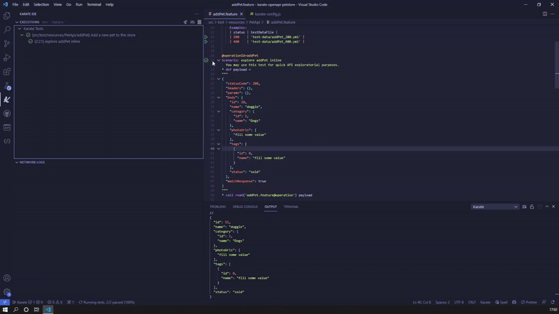

If you are experiencing any trouble or want to rollback to standard process just set `karateIDE.karateCli.useKarateTestServer` setting to `false`.

### Generate Karate Tests from OpenAPI definitions

You can generate Karate tests from OpenAPI definitions including one feature per OpenAPI endpoint. Each feature includes four scenarios: one for validation, one for http call, one inline example payload you can edit and run immediately and one scenario outline for each response code.

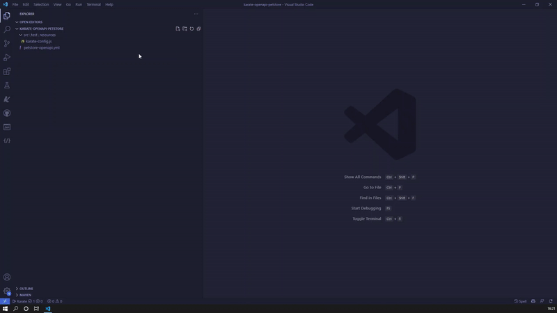

This is how one autogenerated feature looks like:

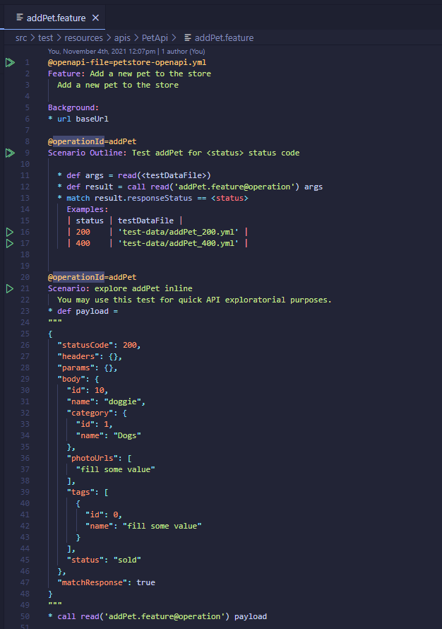

### Generate Stateful Mocks and Start them from the Editor (or Tests Explorer side bar)

You can generate stateful mocks from OpenAPI definitions:

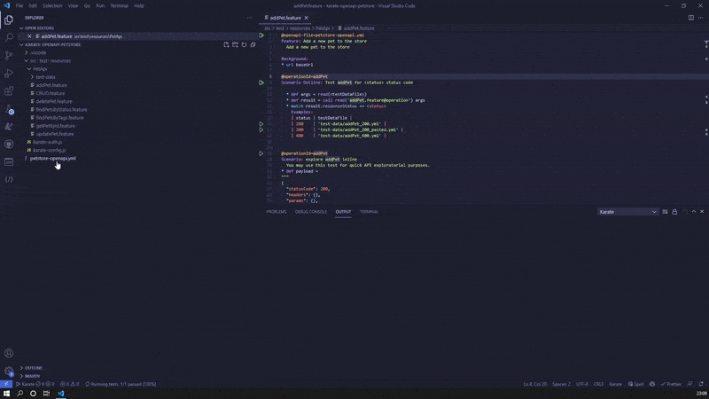

### Generate Simpler Tests for Mock Validation

Validate your mocks with a set of simple generated Karate Tests. Because we delegate payload validation to [ApiMock](https://github.com/ivangsa/apimock) OpenAPI wrapper these tests are much simpler than regular E2E tests.

You should also validate your live API with this same set of tests to make sure your mocks are working as expected. See [VerifyMocksTest.java](https://github.com/ZenWave360/karate-openapi-petstore/blob/master/src/test/java/com/petstore/karate/VerifyMocksTest.java) for a JUnit example you can use in your pipeline.

This is how you can generate them from your OpenAPI definition:

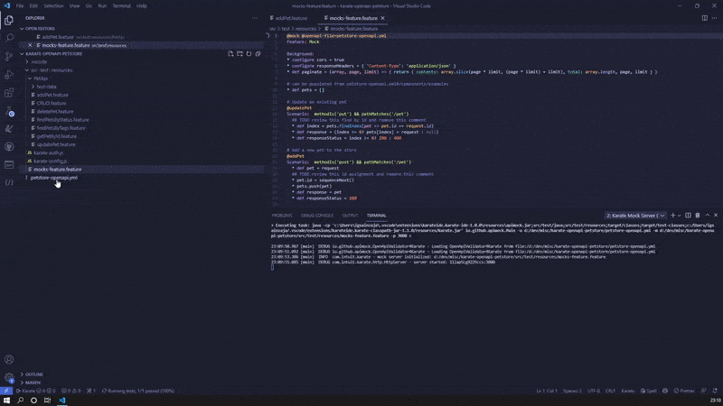

### Generate Tests that spans multiple API calls simulating Business Flows

And yes, you can reuse these karate features, generated from OpenAPI, and compose Business Flow tests with them. Just select in order the API calls you want to chain and Right-Click to select "KarateIDE Generate Business Flow Tests":

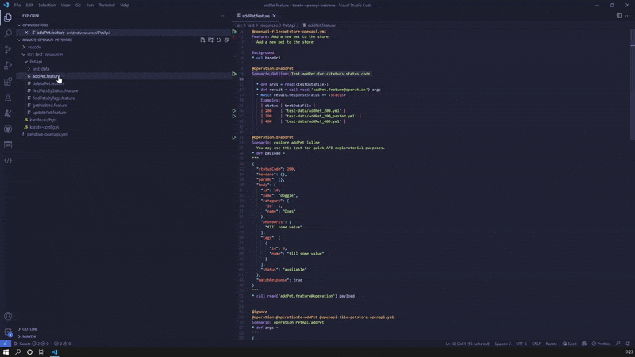

This is how an autogenerated CRUD tests looks like (with payloads collapsed for simplicity). Now you only need edit how your data is chained from one call to the other (see also [PetCRUD.feature](https://github.com/ZenWave360/karate-openapi-petstore/blob/master/src/test/resources/apis/PetApi/PetCRUD.feature) for how a complete working example compares to this one):

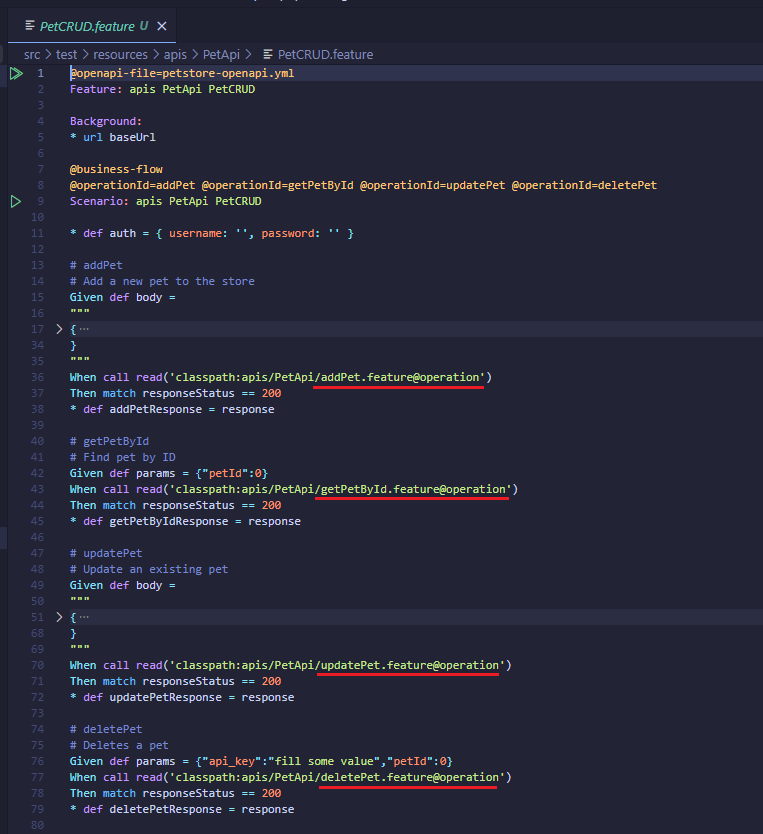

### SmartPaste sample payload into new files in scenario outline examples

Copy sample payloads and paste with Ctrl+Shift+V into scenario outline examples row *filename like* column and and it will create a new file + example row for you.

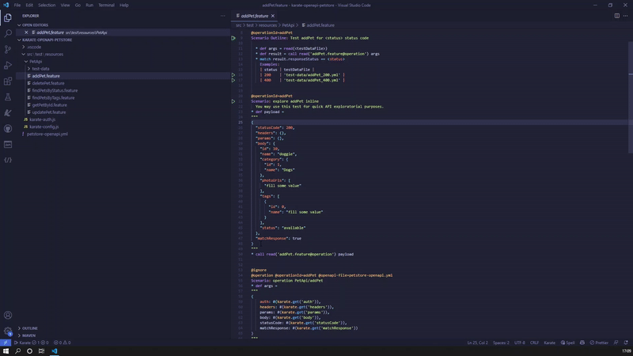

### Many options to explore your logs and response payloads

KarateIDE offers you many options to explore your response data and output logs. Use Executions and Network Logs tree view to explore them.

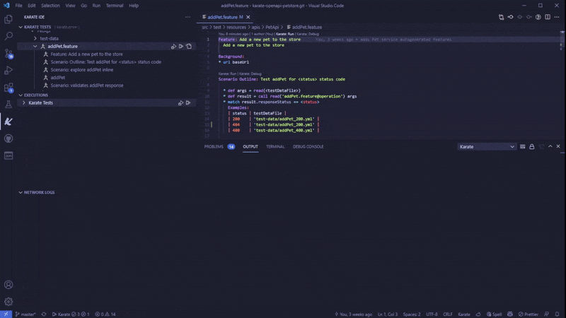

### Replacing old Tests Explorer with native *Test API* from VSCode

With the new Tests API, Visual Studio Code supports richer displays of outputs and diffs than was previously possible. This brings a lot of goodies to your user experience:

- Better looking standard Run/Debug showing in the gutter (replacing old *code lenses*)
- Test Explorer view allows you navigate and filter tests by name, tags, status, etc... To filter by tag use karate prefix in this way `@karate:@yourtag`
- Failing tests error messages are presented in multiple and useful ways (a tooltips, in the gutter, in the tests explorer...)
- Start your Mock Server from Editor and Tests Explorer sidebar

We also have replaced *good old* terminal with Output Channels for greater display flexibility of output logs and response payload.


### Auto Configuration

You can configure this extension `classpath setting` installing [KarateIDE Classpath Jar](https://marketplace.visualstudio.com/items?itemName=KarateIDE.karate-classpath-jar) and running `KarateIDE: Configure Classpath` from Command Palette (View > Command Palette or Ctrl+Shift+P). 

Karate IDE Classpath Jar will update automatically to latest Karate version.


For further configuration options see [Configuration Section](#configuration-options)

### OpenAPI schemas and examples meets Karate Mocks

You can now:

- Leverage OpenAPI schemas and examples for request/response validation and declarative stateless mocks.
- Use KarateDSL for powerful yet simple stateful mocks.
- Use openapi examples to populate your karate mocks initial data.

Navigate to https://github.com/ivangsa/apimock for more details about this integration.

### Debug Karate Scripts

You can also Debug Karate scripts inside KarateIDE. Karate Debug Server is **provided by karate-core** and we are also contributors to.

You can:

- set breakpoints
- step-by-step debugging
- navigate scenario call stack with their variables
- inspect and copy variables, values or their json path expression
- interactive debug console where you can print, update variable values or test jsonPath expressions
- hot reloading (with caveats)

https://twitter.com/KarateDSL/status/1167533484560142336

## Configuration Options

### .vscode/launch.json

When you click `Karate Debug` for the first time if `.vscode/launch.js` does not exist one will be created for you with this contents. This is a one time step, after this file is created you can start debugging normally.

```json
{
    "version": "0.2.0",
    "configurations": [
        {
            "type": "karate-ide",
            "name": "Karate IDE (debug)",
            "request": "launch"
        }
    ]
}
```

### Karate classpath

You have currently three options: Install [KarateIDE Classpath Jar extension](https://marketplace.visualstudio.com/items?itemName=KarateIDE.karate-classpath-jar), manually download Karate "fat" jar from [Karate Release](https://github.com/intuit/karate/releases) or reuse local maven repo artifacts.

If unsure just install [KarateIDE Classpath Jar extension](https://marketplace.visualstudio.com/items?itemName=KarateIDE.karate-classpath-jar) as it will automatically upgrade to each latest karate version.

Please use `KarateIDE: Configure Classpath` command from Command Palette (View > Command Palette or Ctrl+Shift+P) for configuring your classpath.

Karate-IDE will honor your classpath settings when autocompletion and navigating/peeking code with `classpath:` prefix.

#### Manual configuration: Using karate.jar (Karate fat jar)


```json
{
    "karateIDE.karateCli.classpath": "src/test/resources;<path to your file>/karate.jar"
}
```

#### Manual configuration: Using maven repository dependencies

If you are already using maven and karate dependencies are already present in your maven local repository. KarateIDE will replace `${m2.repo}` with the value of `${home}/.m2/repository` or `${MAVEN_HOME}/.m2/repository` if `MAVEN_HOME` env variable is available, but you can configure `karateIDE.karateCli.m2Repo` setting to a different folder.


```json
{
    // full classpath example for for karate 1.1.0 version in windows
    "karateIDE.karateCli.classpath": "src/test/java;src/test/resources;target/classes;target/test-classes;${m2.repo}/com/intuit/karate/karate-core/1.1.0/karate-core-1.1.0.jar;${m2.repo}/org/graalvm/js/js-scriptengine/21.2.0/js-scriptengine-21.2.0.jar;${m2.repo}/org/graalvm/sdk/graal-sdk/21.2.0/graal-sdk-21.2.0.jar;${m2.repo}/org/graalvm/js/js/21.2.0/js-21.2.0.jar;${m2.repo}/org/graalvm/regex/regex/21.2.0/regex-21.2.0.jar;${m2.repo}/org/graalvm/truffle/truffle-api/21.2.0/truffle-api-21.2.0.jar;${m2.repo}/com/ibm/icu/icu4j/69.1/icu4j-69.1.jar;${m2.repo}/ch/qos/logback/logback-classic/1.2.3/logback-classic-1.2.3.jar;${m2.repo}/ch/qos/logback/logback-core/1.2.3/logback-core-1.2.3.jar;${m2.repo}/org/slf4j/slf4j-api/1.7.25/slf4j-api-1.7.25.jar;${m2.repo}/org/slf4j/jcl-over-slf4j/1.7.25/jcl-over-slf4j-1.7.25.jar;${m2.repo}/com/jayway/jsonpath/json-path/2.6.0/json-path-2.6.0.jar;${m2.repo}/net/minidev/json-smart/2.4.7/json-smart-2.4.7.jar;${m2.repo}/net/minidev/accessors-smart/2.4.7/accessors-smart-2.4.7.jar;${m2.repo}/org/ow2/asm/asm/9.1/asm-9.1.jar;${m2.repo}/info/cukes/cucumber-java/1.2.5/cucumber-java-1.2.5.jar;${m2.repo}/info/cukes/cucumber-core/1.2.5/cucumber-core-1.2.5.jar;${m2.repo}/org/yaml/snakeyaml/1.29/snakeyaml-1.29.jar;${m2.repo}/de/siegmar/fastcsv/2.0.0/fastcsv-2.0.0.jar;${m2.repo}/info/picocli/picocli/4.6.1/picocli-4.6.1.jar"
}

```

If you need to add **extra classpath jars** you can use `mvn dependency:build-classpath` for generating a compatible extended classpath.

### Run/Debug command templates

For advanced users, Karate-IDE offers _template_ based configurations for both Run and Debug commands. Variables with *${}* will be replaced by KarateIDE runtime with actual values.

```json
{
    "karateIDE.karateCli.runCommandTemplate": "java '-Dkarate.env=${karateEnv}' '-Dvscode.port=${vscodePort}' -cp '${classpath}' com.intuit.karate.Main ${karateOptions} '${feature}'",
    "karateIDE.karateCli.debugCommandTemplate": "java '-Dkarate.env=${karateEnv}' '-Dvscode.port=${vscodePort}' -cp '${classpath}' com.intuit.karate.Main -d"
}
```

### Multimodule projects

For multimodule project, you may need to configure `karateIDE.multimodule.rootModuleMarkerFile`. Use pom.xml, build.gradle, package.json or any other file that sits on the root of each module.

Karate java process will be started on that folder (first parent folder of current feature file containing a marker file) so classpath will be relative to that folder.

## Other functionality

### Karate.env switcher, Karate Options and MockServer Options

You can switch `karate.env`, Karate options and MockServer options from Executions View title bar. When using Karate-IDE for manual testing or exploring APIs you will find very handy this options switcher.

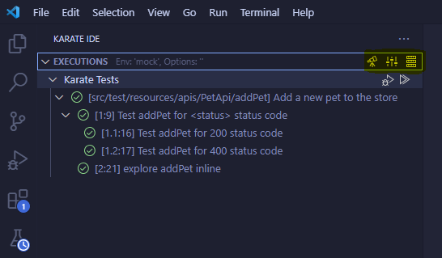

### SmartPaste from cURL in Karate files

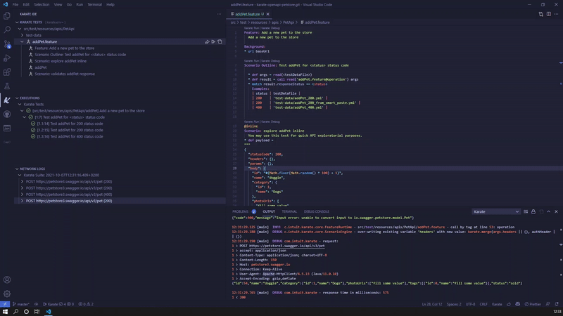

### Code Navigation and Definition Peek

You can navigate between files, features and scenario @tags using `Control-Click` or _peek_ definitions with `Alt+F12`

You can also navigate to scenarios by _@tag_ in the same or in different feature file.

It honors your [classpath](#karate-classpath) setting when navigating to files with `classpath:` prefix.

### Auto-Completion

When reading yml/json files are calling other features you can autocomplete their names with teh list of local and classpath files.

It honors your [classpath](#karate-classpath) setting when navigating to files with `classpath:` prefix.

### Kill vscode.KarateTestProcess command

If you are experiencing trouble with vscode.KarateTestProcess you can always run command `Stop/Kill Karate Tests/Debug Process` to stop a misbehaving process, from `View > Command Palette` or just `Ctrl+P`.


**Enjoy!**
