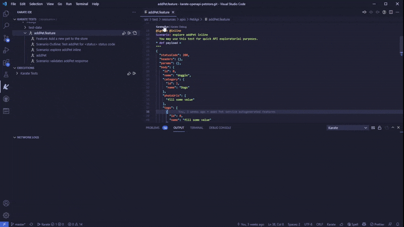
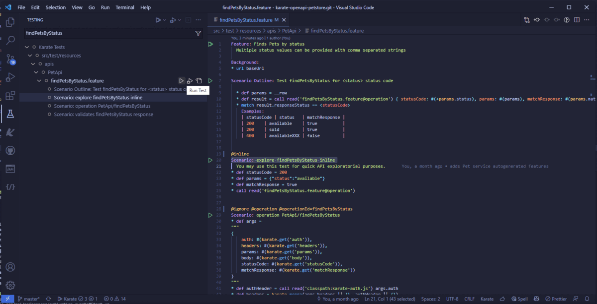
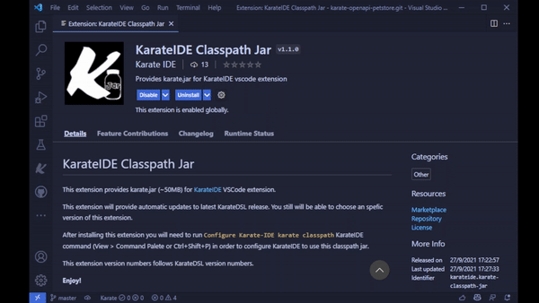
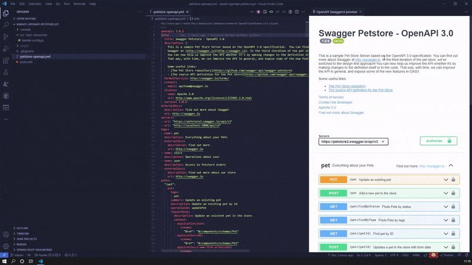
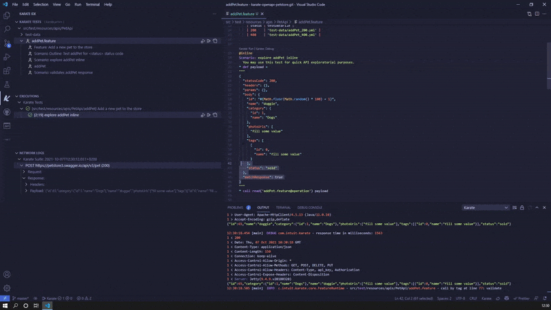

# Karate IDE

> :warning: **WARNING** This extension offering in VSCode marketplace has been reset, including available versions and extension stats. Due to a versioning number error versions v8.0.x and v9.0.x will no longer receive automatic updates. If you have such a version, to keep current, please manually uninstall and install latest version from the marketplace. Thanks and sorry for any inconvenience.

---

Explore your APIs and Debug [Karate](https://github.com/intuit/karate) test scripts within VS Code.

<!-- TOC -->

- [Karate IDE](#karate-ide)
    - [What's New?](#whats-new)
        - [Blazing Fast test Startup](#blazing-fast-test-startup)
        - [Your data at your fingerprints](#your-data-at-your-fingerprints)
        - [Replacing old Tests Explorer with native *Test API* from VSCode](#replacing-old-tests-explorer-with-native-test-api-from-vscode)
    - [Featuring](#featuring)
    - [From Manual Testing to Contract Testing](#from-manual-testing-to-contract-testing)
    - [Auto Configuration](#auto-configuration)
    - [OpenAPI Generator for Quick Exploration and Manual Testing](#openapi-generator-for-quick-exploration-and-manual-testing)
    - [SmartPaste as Outline Example files/rows](#smartpaste-as-outline-example-filesrows)
    - [Reusing generated Scenarios in complex flow/sequence tests](#reusing-generated-scenarios-in-complex-flowsequence-tests)
    - [Generating Mocks from OpenAPI definitions](#generating-mocks-from-openapi-definitions)
    - [Start your Mocks Server from a Menu](#start-your-mocks-server-from-a-menu)
    - [Debug Karate Scripts](#debug-karate-scripts)
    - [Configuration Options](#configuration-options)
        - [vscode/launch.json](#vscodelaunchjson)
        - [Karate classpath](#karate-classpath)
            - [Manual configuration: Using karate.jar Karate fat jar](#manual-configuration-using-karatejar-karate-fat-jar)
            - [Manual configuration: Using maven repository dependencies](#manual-configuration-using-maven-repository-dependencies)
        - [Run/Debug command templates](#rundebug-command-templates)
        - [Multimodule projects](#multimodule-projects)
    - [Other functionality](#other-functionality)
        - [Karate.env switcher](#karateenv-switcher)
        - [SmartPaste from cURL in Karate files](#smartpaste-from-curl-in-karate-files)
        - [Tests Filtering / Focus](#tests-filtering--focus)
        - [Code Navigation and Definition Peek](#code-navigation-and-definition-peek)
        - [Auto-Completion](#auto-completion)
        - [Kill vscode.KarateTestProcess command](#kill-vscodekaratetestprocess-command)

<!-- /TOC -->

## What's New?
### Blazing Fast test Startup

Save a few seconds on each test startup time. With this new release we have introduced `vscode.KarateTestProcess` that reuses the java process in charge or running your Karate tests and debugging sessions.

When running Karate tests in batch a few seconds may not be a lot, but while you are developing, debugging and exploring your api saving a few seconds on each run makes a huge difference!!



If you are experiencing any trouble or want to rollback to standard process just set `karateIDE.karateCli.useKarateTestServer` setting to `false`.

### Your data at your fingerprints

We are now using VSCode OutputChannels instead of the *good old terminal* for output logs. This means that we have now a lot more of flexibility on how we show the logs you want to see.

For instance when your test run one single http request we understand you are mostly interested on response payload, pretty printed.

You can always use *Executions* and *Network Logs* tree views to select what logs you want to focus on:

- Single Scenario, Scenario Outline, Feature or the whole Suite on *Executions* tree view. Also error message is shown as tooltip.
- Or Request/Response payloads, headers... in *Network Logs* tree view


### Replacing old Tests Explorer with native *Test API* from VSCode

With the new Tests API, Visual Studio Code supports richer displays of outputs and diffs than was previously possible. This brings a lot of goodies to your user experience:

- Better looking standard Run/Debug showing in the gutter (replacing old *code lenses*)
- Test Explorer view allows you navigate and filter tests by name, tags, status, etc... To filter by tag use karate prefix in this way `@karate:@yourtag`
- Failing tests error messages are presented in multiple and usefull ways (a tooltips, in the gutter, in the tests explorer...)



## Featuring

With this extension you can:

- Generate Karate test features from OpenAPI definitions (openapi 3.0.0 as yml is currently supported)
- Quickly explore your apis using generated `@inline` Scenarios
- Explore your logs as colorized `OutputChannel`s. Seamless switch from one channel per scenario or all output together (inspired by IntelliJ), search output with Ctrl+F is also supported...
- Explore HTTP requests/responses as structured tree views. Switch between list view and nested scenario calls. Copy payload json or export as cURL.
- `SmartPaste` (Ctrl+V) json payloads as new files/rows for ScenarioOutline Examples
- `SmartPaste` (Ctrl+V) cURL as Karate tests.
- Navigate features and supporting files with `Ctrl+<click>` supporting relative, classpath and even `@tags` on same (or different) feature file.
- Autocompletion of classpath feature names. It honors your classpath settings (see [configuration options](#configuration-options)) when scanning/caching features files.
- Generate Karate Server Side Features (a.k.a. Mocks) from OpenAPI definitions.
- Start `Karate Mock Server` from an UI menu and run your tests against this mock server.
- Switch `karate.env` directly from the UI.

## From Manual Testing to Contract Testing

- Explore, navigate and manual test your API with [OpenAPI generator](#openapi-generator-for-quick-exploration-and-manual-testing)
- Quickly create Scenario Outline Examples using [SmartPaste](#smartpaste-as-outile-example-filesrows) feature
- Validate your response payload using/customizing generated `matchers`
- Build [functional tests](#reusing-generated-scenarios-in-complex-flowsquence-tests) mimicking user flows reusing generated karate tests
- [Generate Karate Mocks](#generating-complete-mocks-from-openapi-definitions) from OpenAPI definitions
- Start and test your [Mocks Server](#start-your-mocks-server-from-a-menu) from KarateIDE
- Test and debug your mocks right inside KarateIDE

Checkout https://github.com/ivangsa/karate-openapi-petstore.git for what autogenerated tests and mocks looks like.
## Auto Configuration

You can configure this extension `classpath setting` installing [KarateIDE Classpath Jar](https://marketplace.visualstudio.com/items?itemName=KarateIDE.karate-classpath-jar) and running `Configure Karate-IDE karate classpath` from Command Palette (View > Command Palette or Ctrl+Shift+P). 

Karate IDE Classpath Jar will update automatically to latest Karate version.



For further configuration options see [Configuration Section](#configuration-options)

## OpenAPI Generator for Quick Exploration and Manual Testing

Use OpenAPI generator for easily bootstrap reusable karate features for quick exploration and manual testing:



## SmartPaste as Outline Example files/rows

When you are happy with your exploratory test payload and params you can paste as new files in Scenario Outlines rows using  Ctrl+V, you will be prompted for new json/yml file:



## Reusing generated Scenarios in complex flow/sequence tests

Generated scenarios can be reused and invoked from other tests, implementing more complex sequences or flows.

You don't need to keep writing http based scenarios every time, but directly reference your API operations by the very name they are documented in your OpenAPI definition.


## Generating Mocks from OpenAPI definitions

You can also generate Mock features for your complete api from openapi definitions. Right click in a openapi yml file and select `Generate Karate Mocks`.

## Start your Mocks Server from a Menu

Start your Mocks Server from a menu and test them directly in KarateIDE. See [Karate Documentation](https://karatelabs.github.io/karate/karate-netty/) for details about how to use Karate for **Contract Testing**.

## Debug Karate Scripts

You can also Debug Karate scripts inside KarateIDE. Karate Debug Server is **provided by karate-core** and we are also contributors to.

You can:

-   set breakpoints
-   step-by-step debugging
-   navigate scenario call stack with their variables
-   inspect and copy variables, values or their json path expression
-   interactive debug console where you can print, update variable values or test jsonPath expressions
-   hot reloading (with caveats)

https://twitter.com/KarateDSL/status/1167533484560142336

## Configuration Options

### .vscode/launch.json

When you click `Karate Debug` for the first time if `.vscode/launch.js` does not exist one will be created for you with this contents. This is a one time step, after this file is created you can start debugging normally.

```json
{
    "version": "0.2.0",
    "configurations": [
        {
            "type": "karate-ide",
            "name": "Karate IDE (debug)",
            "request": "launch"
        }
    ]
}
```

### Karate classpath

You have currently three options: Install [KarateIDE Classpath Jar extension](https://marketplace.visualstudio.com/items?itemName=KarateIDE.karate-classpath-jar), manually download Karate "fat" jar from [Karate Release](https://github.com/intuit/karate/releases) or reuse local maven repo artifacts.

If unsure just install [KarateIDE Classpath Jar extension](https://marketplace.visualstudio.com/items?itemName=KarateIDE.karate-classpath-jar) as it will automatically upgrade to each latest karate version.

Please use `Configure Karate-IDE karate classpath` command from Command Palette (View > Command Palette or Ctrl+Shift+P) for configuring your classpath.

Karate-IDE will honor your classpath settings when autocompletion and navigating/peeking code with `classpath:` prefix.

#### Manual configuration: Using karate.jar (Karate fat jar)


```json
{
    "karateIDE.karateCli.classpath": "src/test/resources;<path to your file>/karate.jar"
}
```

#### Manual configuration: Using maven repository dependencies

If you are already using maven and karate dependencies are already present in your maven local repository. KarateIDE will replace `${m2.repo}` with the value of `${home}/.m2/repository` or `${MAVEN_HOME}/.m2/repository` if `MAVEN_HOME` env variable is available, but you can configure `karateIDE.karateCli.m2Repo` setting to a different folder.


```json
{
    // full classpath example for for karate 1.1.0 version in windows
    "karateIDE.karateCli.classpath": "src/test/java;src/test/resources;target/classes;target/test-classes;${m2.repo}/com/intuit/karate/karate-core/1.1.0/karate-core-1.1.0.jar;${m2.repo}/org/graalvm/js/js-scriptengine/21.2.0/js-scriptengine-21.2.0.jar;${m2.repo}/org/graalvm/sdk/graal-sdk/21.2.0/graal-sdk-21.2.0.jar;${m2.repo}/org/graalvm/js/js/21.2.0/js-21.2.0.jar;${m2.repo}/org/graalvm/regex/regex/21.2.0/regex-21.2.0.jar;${m2.repo}/org/graalvm/truffle/truffle-api/21.2.0/truffle-api-21.2.0.jar;${m2.repo}/com/ibm/icu/icu4j/69.1/icu4j-69.1.jar;${m2.repo}/ch/qos/logback/logback-classic/1.2.3/logback-classic-1.2.3.jar;${m2.repo}/ch/qos/logback/logback-core/1.2.3/logback-core-1.2.3.jar;${m2.repo}/org/slf4j/slf4j-api/1.7.25/slf4j-api-1.7.25.jar;${m2.repo}/org/slf4j/jcl-over-slf4j/1.7.25/jcl-over-slf4j-1.7.25.jar;${m2.repo}/com/jayway/jsonpath/json-path/2.6.0/json-path-2.6.0.jar;${m2.repo}/net/minidev/json-smart/2.4.7/json-smart-2.4.7.jar;${m2.repo}/net/minidev/accessors-smart/2.4.7/accessors-smart-2.4.7.jar;${m2.repo}/org/ow2/asm/asm/9.1/asm-9.1.jar;${m2.repo}/info/cukes/cucumber-java/1.2.5/cucumber-java-1.2.5.jar;${m2.repo}/info/cukes/cucumber-core/1.2.5/cucumber-core-1.2.5.jar;${m2.repo}/org/yaml/snakeyaml/1.29/snakeyaml-1.29.jar;${m2.repo}/de/siegmar/fastcsv/2.0.0/fastcsv-2.0.0.jar;${m2.repo}/info/picocli/picocli/4.6.1/picocli-4.6.1.jar"
}

```

If you need to add **extra classpath jars** you can use `mvn dependency:build-classpath` for generating a compatible extended classpath.

### Run/Debug command templates

For advanced users, Karate-IDE offers _template_ based configurations for both Run and Debug commands. Variables with *${}* will be replaced by KarateIDE runtime with actual values.

```json
{
    "karateIDE.karateCli.runCommandTemplate": "java '-Dkarate.env=${karateEnv}' '-Dvscode.port=${vscodePort}' -cp '${classpath}' com.intuit.karate.Main ${karateOptions} '${feature}'",
    "karateIDE.karateCli.debugCommandTemplate": "java '-Dkarate.env=${karateEnv}' '-Dvscode.port=${vscodePort}' -cp '${classpath}' com.intuit.karate.Main -d"
}
```

There is also `${KarateTestRunner}` template variable if you want to build a command line for JUnit tests.

### Multimodule projects

For multimodule project, you may need to configure `karateIDE.multimodule.rootModuleMarkerFile`. Use pom.xml, build.gradle or any other file that sits on the root of each module.

Karate java process will be started on that folder (first parent folder of current feature file containing a marker file) so classpath will be relative to that folder.

## Other functionality

### Karate.env switcher

You can switch karate.env from the grear icon on tests tree view. When using Karate-IDE for manual testing or exploring APIs you will find very handy this environment switcher.

### SmartPaste from cURL in Karate files


### Tests Filtering / Focus

You have two different ways to filter files that appears on Tests Tree View: using `karateIDE.tests.globFilter` in settings for global filtering and `Focus` icon for temporal filtering of tests and tags.

In `Focus` you can filter by name pattern and by scenario _@tags_ supporting "or & and" constructions: separate tags by comma for AND, quote them for OR and prefix the with ~@ for NOT.
### Code Navigation and Definition Peek

You can navigate between files, features and scenario @tags using `Control-Click` or _peek_ definitions with `Alt+F12`

You can also navigate to scenarios by _@tag_ in the same or in different feature file.

It honors your [classpath](#karate-classpath) setting when navigating to files with `classpath:` prefix.

### Auto-Completion

When reading yml/json files are calling other features you can autocomplete their names with teh list of local and classpath files.

It honors your [classpath](#karate-classpath) setting when navigating to files with `classpath:` prefix.

### Kill vscode.KarateTestProcess command

If you are experiencing trouble with vscode.KarateTestProcess you can always run command `Stop/Kill Karate Tests/Debug Process` to stop a misbehaving process, from `View > Command Palette` or just `Ctrl+P`.


**Enjoy!**
